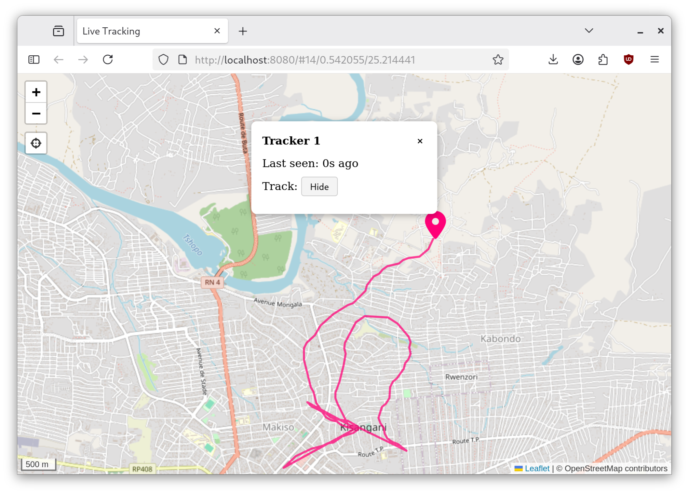

# WIP: Live GPS Tracking Map



## Stack
- Frontend: Leaflet + OpenStreetMap tiles, Font Awesome icons
- Backend: PHP (API), PostgreSQL (storage)
- Live updates: WebSocket (Ratchet, PHP)
- Docker for local testing 

## Setup

1. Download Font Awesome (not included in repo):
```bash
   cd web/public
   mkdir -p vendor
   curl -L -o fontawesome.zip https://use.fontawesome.com/releases/v6.7.2/fontawesome-free-6.7.2-web.zip
   unzip fontawesome.zip -d vendor
   mv vendor/fontawesome-free-6.7.2-web vendor/fontawesome
   rm fontawesome.zip
```

2. Start:
```bash
   docker compose up --build
```

3. Open the map:
   http://localhost:8080

### Testing 

Report a location

```bash
curl -X POST http://localhost:8080/api/report.php \
  -H "Content-Type: application/json" \
  -d '{"api_key":"test-key-123","lat":0.00000,"lon":0.00000,"time_recorded":1723459200}'
```

Simulating live movement

```bash
./scripts/simulate_tracking.sh
```

Clearing saved history

```bash
./scripts/clear_history.sh
```

## To-Do
Lots
